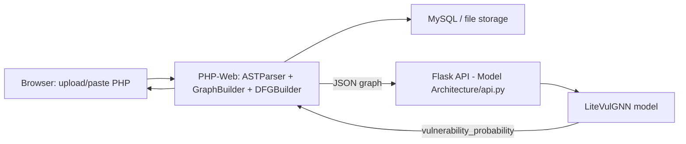

# CodeGraph — PHP Vulnerability Detection with Graph Neural Networks

CodeGraph analyses PHP source code for security vulnerabilities (SQL injection, XSS, command
injection, unsafe `eval`, insecure redirects, etc.) by turning code into a graph — an AST plus a
taint-tracking Data Flow Graph (DFG) — and scoring that graph with a Graph Neural Network (GNN).

The project has three parts that work together:

| Folder | Role |
|---|---|
| [PHP-Web/](PHP-Web) | The web application: upload/paste PHP code, build the AST + DFG in PHP, view the interactive graph and vulnerability report, store analysis history in MySQL (or a file fallback). |
| [Model Architecture/](Model%20Architecture) | The Python inference/training engine: `LiteVulGNN`, a lightweight Gated Graph Neural Network, served over a small Flask API that the PHP app calls to score a graph. |
| [DataSet/](DataSet) | Training data and dataset-building scripts: paired `secure/` and `vulnerable/` PHP samples, an AST/token extractor, and a PyTorch Geometric dataset builder used to train `LiteVulGNN`. |

## How it fits together



1. The PHP app ([PHP-Web/src/ASTParser.php](PHP-Web/src/ASTParser.php)) parses uploaded PHP with
   `nikic/php-parser` into an AST, then [DFGBuilder.php](PHP-Web/src/DFGBuilder.php) adds taint
   edges by tracking data flow from sources (`$_GET`, `$_POST`, `$_REQUEST`, `$_COOKIE`, `$_FILES`)
   to sinks (`mysqli_query`, `exec`, `eval`, ...), through sanitizers when present.
2. [GraphBuilder.php](PHP-Web/src/GraphBuilder.php) merges the AST and DFG into one JSON graph and
   [DataPersistence.php](PHP-Web/src/DataPersistence.php) saves the result (database if configured,
   otherwise flat JSON files under [PHP-Web/storage](PHP-Web/storage)).
3. That JSON graph is also sent to the Python Flask API
   ([Model Architecture/api.py](Model%20Architecture/api.py)), which converts it into PyTorch
   Geometric tensors and runs it through `LiteVulGNN` ([Model Architecture/model.py](Model%20Architecture/model.py)),
   returning a `vulnerability_probability` back to the dashboard.
4. `LiteVulGNN` is trained on graphs built from [DataSet/secure](DataSet/secure) and
   [DataSet/vulnerable](DataSet/vulnerable) — matched pairs of PHP files demonstrating the same
   functionality written safely vs. vulnerably (SQL injection, XSS/echo, command injection via
   `ping`, `eval`, insecure redirects, unsafe file download, weak password storage, insecure session
   restore, unrestricted file upload, and API client SSRF-style issues).

## Getting started

See [PHP-Web/README.md](PHP-Web/README.md) for full setup/run instructions for the web app, and
[DataSet/LiteVulGNN_Research.ipynb](DataSet/LiteVulGNN_Research.ipynb) plus
[DataSet/raw/build_dataset.py](DataSet/raw/build_dataset.py) for how the training dataset is built.

Quick start:

```bash
# 1. Web app (PHP)
cd PHP-Web
composer install
composer start          # serves http://localhost:8080

# 2. Model API (Python)
cd "Model Architecture"
pip install torch torch_geometric flask
python api.py            # serves http://127.0.0.1:5000/scan
```

Upload a `.php` file through the dashboard at `http://localhost:8080`; the PHP backend builds the
graph and calls the Flask `/scan` endpoint to get a vulnerability score back.
